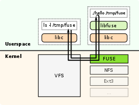

# Flat in-memory filesystem with data stored as blocks

This assignment deals with the changing the design of a flat in-memory filesystem to store the data in blocks. There are a lot of advantages of storing data as blocks, they are, improved input and output operations, better error detection and correction, redundancy and replication for fault tolerance.

## FUSE filesystem

Before working on this assignment it is necessary to have a good understanding of the FUSE filesystem. FUSE stands for 'Filesystem in user space'. It is a software interface for Unix like computer operating systems that lets non-previleged users create their own filesystems without editing kernel code. This is achieved by running the filesystem code in user space while FUSE module provides only a "bridge" to the actual kernel interfaces. 

To implement a new file system, a handler program linked to the supplied libfuse library needs to be written. The main purpose of this program is to specify how the file system is to respond to read/write/stat requests. The program is also used to mount the new file system. At the time the file system is mounted, the handler is registered with the kernel. If a user now issues read/write/stat requests for this newly mounted file system, the kernel forwards these IO-requests to the handler and then sends the handler's response back to the user.

## Design 

The [memory.py](https://github.com/fusepy/fusepy/blob/master/examples/memory.py) file is the starting point of this assignment. This file has the flat filesystem implementation of a UNIX like file system. The task is to store all the file data in blocks of equal size but the upper filesystem layers should not feel any difference about this happening in the background. 

The methods that we have to alter to achieve this task are read, write and truncate. The file [memoryblockfs.py](memoryblockfs.py) has the changed methods for read, write and truncate and it achieves splitting the file data into blocks of 8 byte size. 

## Author information

Shreyas Gaadikere Sreedhara, Email - shreyasgaadikere@ufl.edu